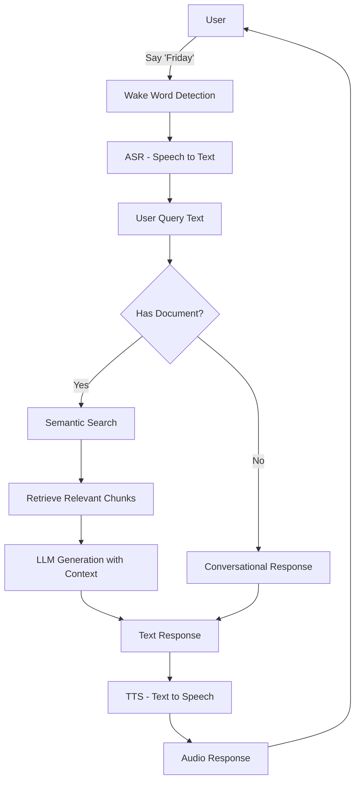

# 🎙️ Friday - Voice RAG Assistant

<div align="center">
  


  
</div>

<div align="center">
  <p><i>Animation: Voice-activated document assistant in action</i></p>
</div>

> *"Hey Friday, what's in this document?"*

A voice-activated Retrieval Augmented Generation (RAG) application that allows users to interact with PDF documents through natural voice commands. Simply say **"Friday"** to activate the assistant, ask questions about your documents, and receive spoken responses.

## 📑 Table of Contents

- [✨ Features](#-features)
- [🛠️ Technical Stack](#️-technical-stack)
- [📂 Project Structure](#-project-structure)
- [💻 System Requirements](#-system-requirements)
- [🚀 Installation](#-installation)
- [🚀 Running the Application](#-running-the-application)
- [📖 Usage Guide](#-usage-guide)
- [🔌 API Endpoints](#-api-endpoints)
- [🛡️ Edge Case Handling](#️-edge-case-handling)
- [👨‍💻 Development](#-development)
- [🤝 Contributing](#-contributing)
- [📜 License](#-license)
- [⚠️ Troubleshooting](#️-troubleshooting)
- [🙏 Acknowledgments](#-acknowledgments)
- [💬 Contact & Support](#-contact--support)

## ✨ Features

- 🎵 **Voice-Activated Interface**: Wake word "Friday" for hands-free operation
- 📄 **PDF Document Processing**: Upload and interact with any PDF document
- 🧠 **Conversational Memory**: Maintains context for follow-up questions
- 💫 **Modern UI with Animations**: Responsive CSS animations for all application states
- 🛡️ **Edge Case Handling**: Robust error handling and fallbacks
- 🔄 **WebSocket Communication**: Real-time voice detection and processing
- 📦 **Fully Open Source**: All components use open-source models and libraries

## 🛠️ Technical Stack

<table>
  <tr>
    <td><b>🔧 Backend</b></td>
    <td>FastAPI, Python 3.12+</td>
  </tr>
  <tr>
    <td><b>🌐 Frontend</b></td>
    <td>HTML5, CSS3, JavaScript with WebSockets</td>
  </tr>
  <tr>
    <td rowspan="4"><b>🧠 AI Models</b></td>
    <td>🎤 <b>ASR</b>: NVIDIA NeMo Parakeet RNNT (Speech-to-Text)</td>
  </tr>
  <tr>
    <td>🔍 <b>Embeddings</b>: Ollama with Nomic Embed Text</td>
  </tr>
  <tr>
    <td>🤖 <b>LLM</b>: Ollama with Gemma3 4B Instruct</td>
  </tr>
  <tr>
    <td>🔊 <b>TTS</b>: Kokoro (Text-to-Speech)</td>
  </tr>
  <tr>
    <td><b>🗄️ Vector Storage</b></td>
    <td>FAISS for efficient semantic search</td>
  </tr>
</table>

## 📂 Project Structure

<details>
<summary>Click to expand project structure</summary>

```bash
├── app/                  # 🔧 FastAPI application
│   ├── api/              # 🌐 API endpoints
│   ├── core/             # ⚙️ Core configuration
│   ├── services/         # 🧩 Business logic
│   ├── main.py           # 🚀 FastAPI app entry point
│   └── models_init.py    # 🧠 AI model initialization
├── data/                 # 💾 Data storage
│   ├── uploads/          # 📄 Uploaded PDFs
│   └── temp_audio/       # 🔊 Generated audio responses
├── faiss_index/          # 🔍 FAISS vector database
├── logs/                 # 📝 Application logs
├── static/               # 🎨 Frontend files
│   ├── css/              # 🎭 CSS styles
│   ├── js/               # ⚡ JavaScript
│   └── gifs/             # 🌟 Visual feedback animations (legacy)
├── pyproject.toml        # 📦 Python dependencies (Poetry)
└── run.py                # 🚀 Application entry point
```

</details>

## 💻 System Requirements

<table>
  <tr>
    <td><b>📋 Software</b></td>
    <td>
      • Python 3.12+<br>
      • <a href="https://ollama.com/download">Ollama</a> (for LLM and embeddings)<br>
      • espeak-ng (required by Kokoro for TTS)
    </td>
  </tr>
  <tr>
    <td><b>🖥️ Hardware</b></td>
    <td>
      • At least 8GB RAM recommended<br>
      • Microphone for voice input<br>
      • Speakers for audio output
    </td>
  </tr>
  <tr>
    <td><b>⚡ Acceleration</b></td>
    <td>
      GPU acceleration supported but not required:<br>
      • CUDA for NVIDIA GPUs<br>
      • MPS for Apple Silicon
    </td>
  </tr>
</table>

## 🚀 Installation

<details open>
<summary><b>Step 1: Clone the Repository</b></summary>

```bash
git clone https://github.com/vignanchoutpally/voice-rag.git
cd voice-rag
```
</details>

<details open>
<summary><b>Step 2: Install Dependencies</b></summary>

**Using Poetry (recommended):**
```bash
# Install Poetry if you don't have it
curl -sSL https://install.python-poetry.org | python3 -
# Install dependencies
poetry install
```

**Or using pip:**
```bash
pip install -e .
```
</details>

<details open>
<summary><b>Step 3: Install espeak-ng</b></summary>

**For macOS:**
```bash
brew install espeak-ng
```

**For Ubuntu/Debian:**
```bash
sudo apt-get install espeak-ng
```

**For Windows:**  
Download from [espeak-ng GitHub releases](https://github.com/espeak-ng/espeak-ng/releases)
</details>

<details open>
<summary><b>Step 4: Install and Setup Ollama Models</b></summary>

```bash
# Install Ollama from https://ollama.com/download
# Then pull the required models
ollama pull nomic-embed-text
ollama pull gemma3:4b-it-qat
```
</details>

## 🚀 Running the Application

<div align="center">
  
</div>

<ol>
  <li>
    <b>Start the FastAPI server:</b>
    <pre><code class="language-bash"># Using the run script
python run.py

### Or directly with uvicorn
uvicorn app.main:app --host 0.0.0.0 --port 8000 --reload</code></pre>
  </li>
  <li>
    <b>Open your web browser and navigate to:</b>
    <pre><code>http://localhost:8000</code></pre>
  </li>
</ol>

## 📖 Usage Guide

<div align="center">
  <table>
    <tr>
      <td align="center"><h3>📤</h3></td>
      <td><b>1. Upload a PDF</b><br>Start by uploading a PDF document using the "Select PDF File" button</td>
    </tr>
    <tr>
      <td align="center"><h3>🗣️</h3></td>
      <td><b>2. Activate with Voice</b><br>Say "Friday" to activate the voice assistant</td>
    </tr>
    <tr>
      <td align="center"><h3>❓</h3></td>
      <td><b>3. Ask Questions</b><br>After the assistant acknowledges, ask any question about your document</td>
    </tr>
    <tr>
      <td align="center"><h3>👂</h3></td>
      <td><b>4. View Responses</b><br>The assistant will provide spoken responses and display them in the conversation area</td>
    </tr>
    <tr>
      <td align="center"><h3>🔄</h3></td>
      <td><b>5. Follow-up Questions</b><br>Ask follow-up questions without saying "Friday" again during an active conversation</td>
    </tr>
  </table>
</div>

### 💬 Example Queries:

<div class="example-queries">
  <blockquote>"Friday, what are the key points in this document?"</blockquote>
  <blockquote>"What does section 3 discuss?"</blockquote>
  <blockquote>"Can you explain the concept of [topic in document]?"</blockquote>
  <blockquote>"What are the eligibility requirements mentioned?"</blockquote>
</div>

## 🔌 API Endpoints

<div align="center">
  <h4>The application provides RESTful and WebSocket endpoints:</h4>
</div>

<table align="center">
  <tr>
    <th>Endpoint</th>
    <th>Method</th>
    <th>Description</th>
    <th>Icon</th>
  </tr>
  <tr>
    <td><code>/api/v1/upload_pdf</code></td>
    <td>POST</td>
    <td>Upload and index a PDF document</td>
    <td>📤</td>
  </tr>
  <tr>
    <td><code>/api/v1/chat_text</code></td>
    <td>POST</td>
    <td>Text-based query and response</td>
    <td>💬</td>
  </tr>
  <tr>
    <td><code>/api/v1/chat_voice</code></td>
    <td>POST</td>
    <td>Voice query and spoken response</td>
    <td>🎤</td>
  </tr>
  <tr>
    <td><code>/api/v1/audio/{filename}</code></td>
    <td>GET</td>
    <td>Retrieve generated audio responses</td>
    <td>🔊</td>
  </tr>
  <tr>
    <td><code>/api/v1/status</code></td>
    <td>GET</td>
    <td>Check application health and models status</td>
    <td>🩺</td>
  </tr>
  <tr>
    <td><code>/api/v1/clear_state</code></td>
    <td>POST</td>
    <td>Clear application state</td>
    <td>🧹</td>
  </tr>
  <tr>
    <td><code>/api/v1/ws/listen</code></td>
    <td>WebSocket</td>
    <td>Real-time wake word detection</td>
    <td>👂</td>
  </tr>
  <tr>
    <td><code>/api/v1/ws/heartbeat</code></td>
    <td>WebSocket</td>
    <td>Connection health monitoring</td>
    <td>💓</td>
  </tr>
</table>

## 🛡️ Edge Case Handling

<div align="center">
  
</div>

<table>
  <tr>
    <td align="center">🔄</td>
    <td>Automatically resets conversation when new documents are loaded</td>
  </tr>
  <tr>
    <td align="center">💬</td>
    <td>Provides appropriate responses when no document is loaded</td>
  </tr>
  <tr>
    <td align="center">💓</td>
    <td>Handles network interruptions with WebSocket heartbeats</td>
  </tr>
  <tr>
    <td align="center">🎤</td>
    <td>Manages audio device selection and fallbacks</td>
  </tr>
  <tr>
    <td align="center">🧹</td>
    <td>Cleans up temporary files and resources</td>
  </tr>
</table>

## 👨‍💻 Development

<div align="center">
  
</div>

### 🧰 Prerequisites

<ul>
  <li>🐍 Python 3.12+</li>
  <li>📦 Poetry for dependency management</li>
  <li>🤖 Ollama server running locally</li>
</ul>

### 🛠️ Setting Up Development Environment

```bash
# Clone the repository
git clone https://github.com/vignanchoutpally/voice-rag.git
cd voice-rag

# Install dev dependencies
poetry install

# Start the development server
poetry run python run.py
```

### 🏛️ Project Architecture

<div align="center">
  
</div>

<div class="architecture-diagram">
  <table>
    <tr>
      <td><b>🌐 Frontend</b></td>
      <td>Vanilla HTML/CSS/JavaScript with WebSocket communication</td>
    </tr>
    <tr>
      <td><b>⚙️ Backend</b></td>
      <td>FastAPI handles HTTP and WebSocket endpoints</td>
    </tr>
    <tr>
      <td><b>🔄 RAG Pipeline</b></td>
      <td>
        1. 📄 Document processing (PDF → text chunks)<br>
        2. 🗄️ Vector indexing (FAISS)<br>
        3. 🔍 Query processing (voice → text → vector search → context retrieval → LLM response → speech)
      </td>
    </tr>
  </table>
</div>

### 🔄 Flow Diagram



<div align="center"><i>Flow diagram showing the application's voice RAG pipeline</i></div>

### 🔧 Adding New Features

<div class="feature-expansion">
  <table>
    <tr>
      <td><b>📄 New Document Types</b></td>
      <td>Extend <code>document_service.py</code> with additional document processors</td>
    </tr>
    <tr>
      <td><b>🧠 Different Language Models</b></td>
      <td>Update <code>models_init.py</code> to use alternative LLMs</td>
    </tr>
    <tr>
      <td><b>🎨 UI Customization</b></td>
      <td>Modify the HTML/CSS in the <code>static</code> directory</td>
    </tr>
  </table>
</div>

## 🤝 Contributing

<div align="center">
  
</div>

We love your input! Contributions are welcome! Please feel free to submit a Pull Request.

<div class="contribution-steps">
  <ol>
    <li>🍴 <b>Fork</b> the project</li>
    <li>🌿 Create your feature branch (<code>git checkout -b feature/amazing-feature</code>)</li>
    <li>💾 Commit your changes (<code>git commit -m 'Add some amazing feature'</code>)</li>
    <li>⬆️ Push to the branch (<code>git push origin feature/amazing-feature</code>)</li>
    <li>🔍 Open a Pull Request</li>
  </ol>
</div>

<p align="center">
  See the <a href="CONTRIBUTING.md">CONTRIBUTING.md</a> file for detailed guidelines
</p>

## 📜 License

<div align="center">
  
</div>

<p align="center">
  This project is licensed under the MIT License - see the <a href="LICENSE">LICENSE</a> file for details.
</p>

## ⚠️ Troubleshooting

<div align="center">
  
</div>

### 🔍 Verifying Your Setup

<p>The project includes a verification script to check if your system is properly configured:</p>

```bash
python verify.py
```

<div class="verification-checks">
  <table>
    <tr>
      <th colspan="2">This script checks for:</th>
    </tr>
    <tr>
      <td width="50px" align="center">📁</td>
      <td>Required directories and files</td>
    </tr>
    <tr>
      <td align="center">💻</td>
      <td>Hardware configuration (GPU acceleration)</td>
    </tr>
    <tr>
      <td align="center">🎤</td>
      <td>Audio devices availability</td>
    </tr>
    <tr>
      <td align="center">🔊</td>
      <td>Audio recording functionality</td>
    </tr>
  </table>
</div>

### 🚨 Common Issues

<details>
<summary><b>🎤 No audio input detected</b></summary>
<ul>
  <li>Check your microphone permissions</li>
  <li>Verify your microphone is working in other applications</li>
  <li>Try selecting a different audio input device</li>
</ul>
</details>

<details>
<summary><b>🗣️ Wake word detection not working</b></summary>
<ul>
  <li>Ensure your environment is reasonably quiet</li>
  <li>Speak "Friday" clearly and wait for acknowledgment</li>
  <li>Try adjusting your microphone volume</li>
</ul>
</details>

<details>
<summary><b>⏱️ Slow response times</b></summary>
<ul>
  <li>For faster processing, use a system with GPU acceleration</li>
  <li>Try using smaller PDF documents</li>
  <li>Check that Ollama is running optimally on your system</li>
</ul>
</details>

<details>
<summary><b>❌ "Embeddings model not initialized" error</b></summary>
<p>Verify that Ollama is installed and running</p>
<p>Check that you've pulled the required models:</p>

```bash
ollama pull nomic-embed-text
ollama pull gemma3:4b-it-qat
```
</details>

<details>
<summary><b>🔊 espeak-ng errors</b></summary>
<ul>
  <li>Verify espeak-ng is properly installed</li>
  <li>On Linux, try: <code>sudo apt-get install --reinstall espeak-ng</code></li>
</ul>
</details>

## 🙏 Acknowledgments

<div align="center">
  <table>
    <tr>
      <td align="center"></td>
      <td>For the web framework</td>
    </tr>
    <tr>
      <td align="center"></td>
      <td>NeMo toolkit for ASR capabilities</td>
    </tr>
    <tr>
      <td align="center"></td>
      <td>For local LLM and embeddings</td>
    </tr>
    <tr>
      <td align="center"></td>
      <td>For text-to-speech capabilities</td>
    </tr>
    <tr>
      <td align="center"></td>
      <td>For efficient vector indexing</td>
    </tr>
    <tr>
      <td align="center"></td>
      <td>For RAG workflow</td>
    </tr>
  </table>
</div>

<hr>

## 💬 Contact & Support

<div align="center">
  <table>
    <tr>
      <td align="center"></td>
      <td><a href="https://github.com/vignanchoutpally/voice-rag/issues">Submit Issues & Feature Requests</a></td>
    </tr>
    <tr>
      <td align="center"></td>
      <td><a href="https://x.com/vignan7013">Follow for Updates</a></td>
    </tr>
    <tr>
      <td align="center"></td>
      <td><a href="mailto:vignandon2@gmail.com">Contact Developer</a></td>
    </tr>
  </table>
</div>

<div align="center">
  <p>Made with ❤️ for voice-powered document assistants</p>
  <p>© 2025 | <a href="https://github.com/vignanchoutpally">Vignan Choutpally</a></p>
</div>
